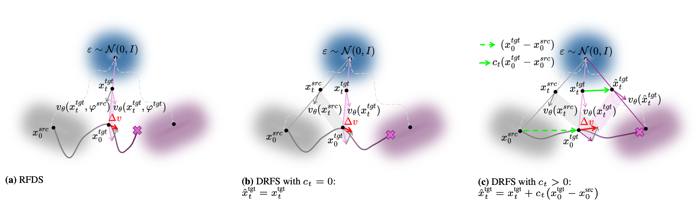
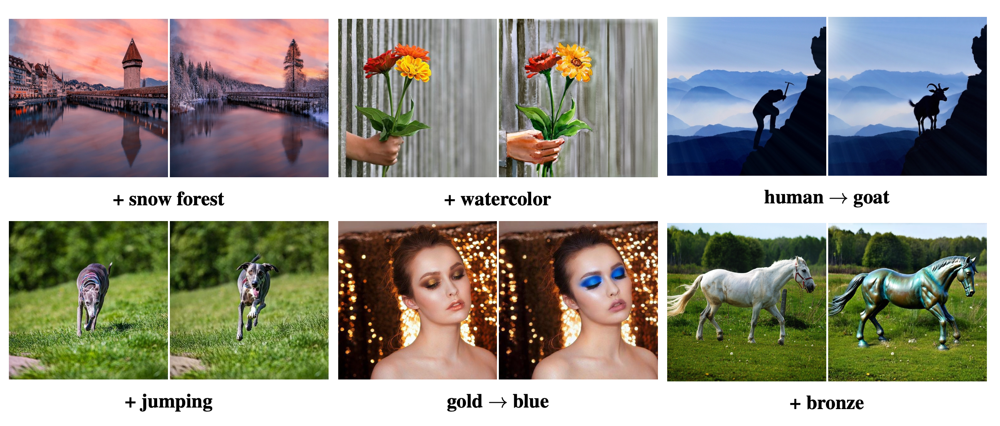
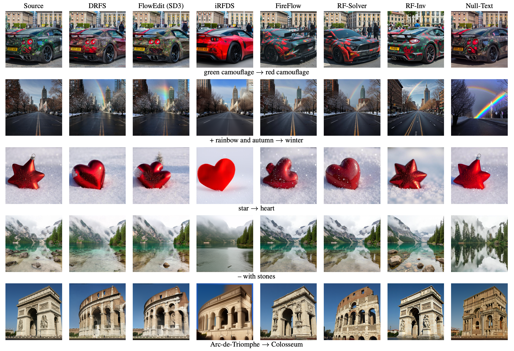
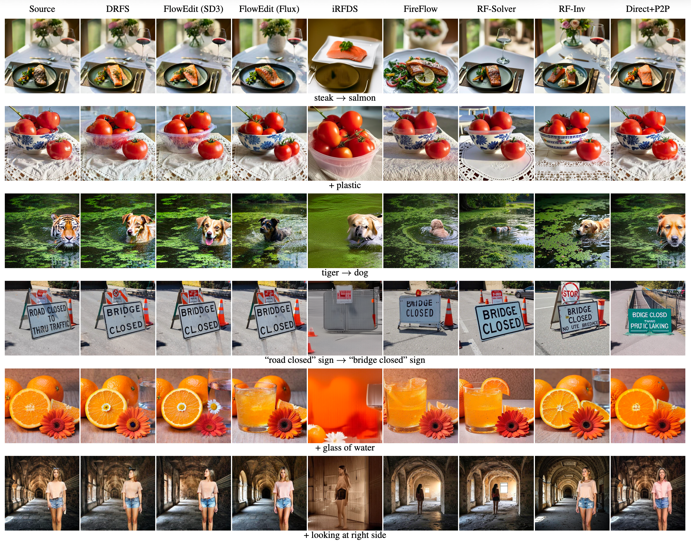

# Delta Rectified Flow Sampling (DRFS)

### [Paper](https://arxiv.org/abs/2509.05342) | CVPR 2026

Official implementation of **"Delta Rectified Flow Sampling for Text-to-Image Editing"** (CVPR 2026).

> **Delta Rectified Flow Sampling for Text-to-Image Editing**  
> [Gaspard Beaudouin](https://scholar.google.com/citations?user=PLACEHOLDER), [Minghan Li](https://scholar.google.com/citations?user=PLACEHOLDER), [Jaeyeon Kim](https://scholar.google.com/citations?user=PLACEHOLDER), [Sung-Hoon Yoon](https://scholar.google.com/citations?user=PLACEHOLDER), [Mengyu Wang](https://scholar.google.com/citations?user=PLACEHOLDER)

---

### Overview

DRFS is a text-guided image editing method that optimizes the latent representation of a pre-trained rectified-flow model (SD3 / SD3.5) by matching the delta between source and target velocity predictions. Inspired by Delta Denoising Score for diffusion models, DRFS introduces a trajectory-driven editing objective that operates in the velocity space of rectified flows, together with a progressive shift term for improved editing performance. DRFS achieves state-of-the-art results on the PIE Benchmark while preserving the structure of the source image.

- **Models**: Stable Diffusion 3 (SD3), Stable Diffusion 3.5 (`medium`, `large`, `large-turbo`)
- **Pipelines**: Hugging Face Diffusers
- **Input**: Source image + source prompt + target prompt(s)
- **Output**: Edited image

---

### Method



---

### Results







---

### Installation

```bash
git clone https://github.com/Harvard-AI-and-Robotics-Lab/DeltaRectifiedFlowSampling.git
cd DeltaRectifiedFlowSampling
conda env create -f drfs_environment.yml
conda activate drfs_env
```

---

### Quick Start

1. Configure your experiment in `exp.yaml`:

```yaml
- exp_name: "DRFS_SD3"
  dataset_yaml: images/mapping_file.yaml
  model_type: "SD3"              # SD3, SD3.5, SD3.5-medium, SD3.5-large, SD3.5-large-turbo
  T_steps: 50                    # diffusion timesteps
  B: 1                           # batch size for averaging the gradient
  src_guidance_scale: 6
  tgt_guidance_scale: 16.5
  num_steps: 50                  # number of optimization steps
  seed: 41
  eta: 1.0                       # progressive c_t = k/T · t (see paper)
  scheduler_strategy: "descending"  # "random" or "descending"
  lr: "custom"                   # adaptive lr from the paper, or a constant float
  optimizer: "SGD"               # SGD, Adam, AdamW, RMSprop, SGD_Nesterov
```

2. Prepare `images/mapping_file.yaml` with your images and prompts:

```yaml
- input_img: images/a_cat_sitting_on_a_table.png
  source_prompt: A cat sitting on a table.
  target_prompts:
    - A lion sitting on a table.
```

3. Run editing:

```bash
python edit.py --exp_yaml exp.yaml
```

Results are saved to `outputs/<exp_name>/<model_type>/src_<image>/tgt_<index>/`.

---

### Repository Structure

```
DeltaRectifiedFlowSampling/
├── assets/                     # Paper figures
├── images/                     # Example images and dataset config
│   └── mapping_file.yaml
├── models/
│   ├── __init__.py
│   └── DRFS.py                 # Core DRFS algorithm
├── edit.py                     # Main entry point
├── exp.yaml                    # Experiment configuration
├── drfs_environment.yml        # Conda environment
└── README.md
```

---

### Citation

If you find this work useful, please cite:

```bibtex
@InProceedings{Beaudouin_2026_CVPR,
    author    = {Beaudouin, Gaspard and Li, Minghan and Kim, Jaeyeon and Yoon, Sung-Hoon and Wang, Mengyu},
    title     = {Delta Rectified Flow Sampling for Text-to-Image Editing},
    booktitle = {Proceedings of the IEEE/CVF Conference on Computer Vision and Pattern Recognition (CVPR)},
    month     = {June},
    year      = {2026},
    pages     = {18662-18672}
}
```

---

### License

This work is licensed under a [Creative Commons Attribution 4.0 International License](http://creativecommons.org/licenses/by/4.0/).

---

### Acknowledgements

Built on [Hugging Face Diffusers](https://github.com/huggingface/diffusers) and Stable Diffusion 3 / 3.5. Thanks to the open-source community.
